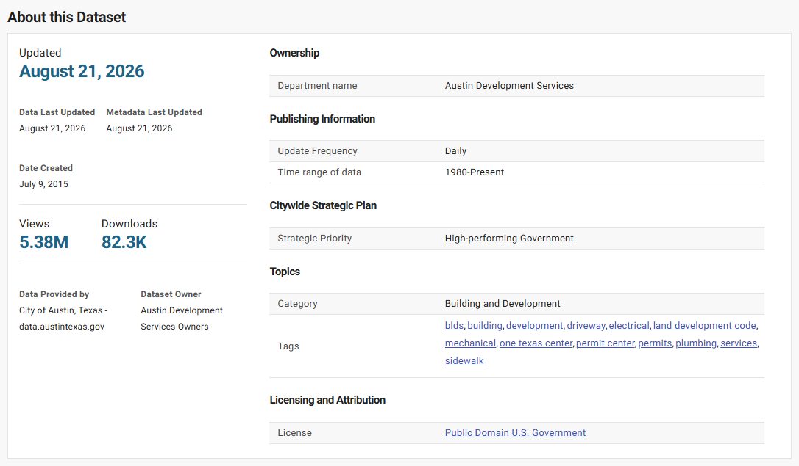
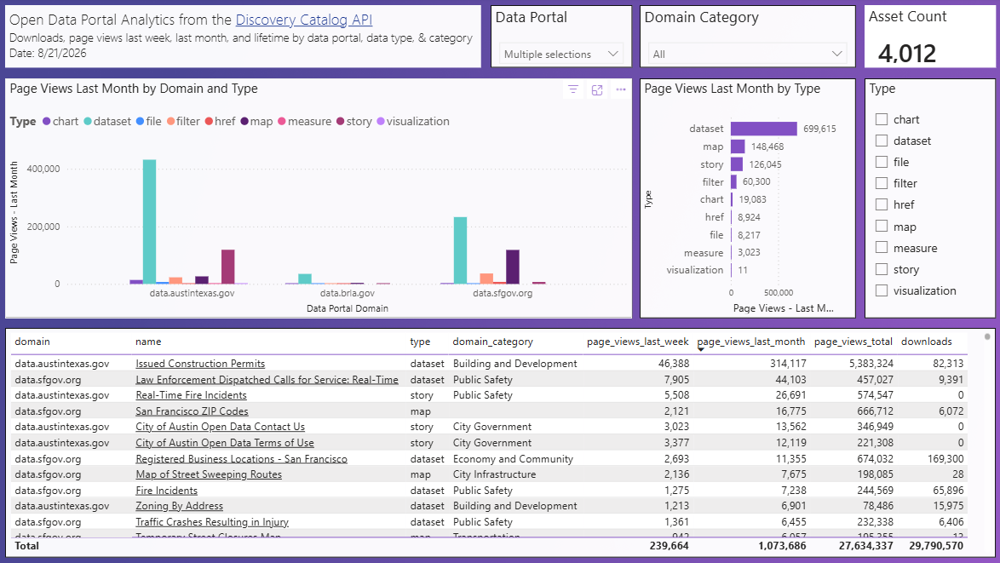

The first step to find analytic information is to locate the data catalog on a data portal. Organizations may have multiple data portals that house their data. Common data portal providers that publish web analytic information include Tyler Technologies[^1] and Esri[^2].

[^1]: Tyler Technologies. (2022, December 20). *Data & Insights Site Analytics*. Data & Insights Client Center. <https://support.socrata.com/hc/en-us/articles/360045612793-Data-Insights-Site-Analytics>

[^2]: *Monitor item usage—ArcGIS Online Help \| Documentation*. (n.d.). Retrieved August 16, 2026, from <https://doc.arcgis.com/en/arcgis-online/manage-data/monitor-item-usage.htm>

## Data Catalogs

Example data catalogs include:

- Austin, Texas

  - Data catalog: <https://data.austintexas.gov/browse>

  - Map catalog: <https://austin.maps.arcgis.com/home/gallery.html>

- Baton Rouge, Louisiana

  - Data catalog: <https://data.brla.gov/browse>

  - Maps and applications catalog: <https://data-ebrgis.opendata.arcgis.com/search>

- San Francisco, California

  - Data catalog: <https://data.sfgov.org/browse>

  - Maps and : <https://sfgov.maps.arcgis.com/home/gallery.html>

## Web Analytics

Data portals publish the number of page views for data assets on overview pages and through APIs (application programming interface).

### Overview Pages

Dataset overview pages provide important details about the data and lifetime page views and downloads. An example of an overview page is the [Issued Construction Permits](https://data.austintexas.gov/Building-and-Development/Issued-Construction-Permits/3syk-w9eu/about_data) on the Austin data portal.

[{fig-alt="Screenshot showing the about section on the Issue Building Permits dataset overview page"}](https://data.austintexas.gov/Building-and-Development/Issued-Construction-Permits/3syk-w9eu/about_data)

In the "About" section, the lifetime views and downloads are shown, which for this dataset consist of 5.38 million views and 82.3 thousand downloads.

### APIs (Application programming interfaces)

The Tyler Technologies [Discovery API](https://dev.socrata.com/docs/other/discovery#?route=overview--purpose)[^3] provides analytic details for all data assets on a data portal that includes lifetime views and downloads, as well as views in the last week and month, providing insights on current public interest. Authentication is not required to access information about published data assets on domain. Tools like Excel and Power BI can easily connect to the API endpoint to make information available for analysis.

[^3]: *Socrata Discovery API*. (n.d.). Retrieved August 18, 2026, from <https://dev.socrata.com/docs/other/discovery#?route=overview--purpose>

Example API endpoint with parameters to retrieve all published data assets by data portal domain:

- Austin, Texas

  - Discovery catalog endpoint: <http://api.us.socrata.com/api/catalog/v1?search_context=data.austintexas.gov&published=true&limit=5000>

- Baton Rouge, Louisiana

  - Discovery catalog endpoint: <http://api.us.socrata.com/api/catalog/v1?search_context=data.brla.gov&published=true&limit=5000>

- San Francisco, California

  - Discovery catalog endpoint: <http://api.us.socrata.com/api/catalog/v1?search_context=data.sfgov.org&published=true&limit=5000>

The following screenshot of a Power BI report demonstrates the type of useful information that can be found about the use of data assets from open data portals. The report and an excel file are available on the code repository for demonstration purposes.

{fig-alt="Dashboard screenshot of a Power BI report with analytic data for Austin, Baton Rouge, and San Francisco open data assets"}

### Data Portal Detailed Reports

Data portal publishers have additional analytic data available to them, including measures with date and time information and often share that information publicly.

Example portal reports:

- Austin, Texas

  - [Open Data Portal Web Analytics Dashboard](https://data.austintexas.gov/stories/s/6tzi-5xt6)

- Baton Rouge, Louisiana

  - [Website Analytics Dataset](https://data.brla.gov/Government/Website-Analytics/n9u7-h9i7/about_data)

- San Francisco, California

  - [Dataset Inventory Explorer](https://data.sfgov.org/stories/s/Dataset-Inventory-Explorer/dztp-vt7z/)
