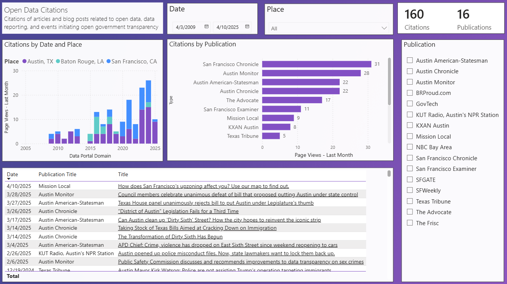

The potential for journalists and researchers to act as intermediaries of open data by synthesizing open data into useful information [@shaharudin2023] and creating feedback loops to government [@wilson2019]. While new opportunities for rich storytelling through narratives and digital tools created by data reporters, there is also a concern that they are not accessible to everyone [@felle2016] and depend on access to devices, internet, and subscriptions to news services.

The following screenshot of a Power BI report demonstrates the number of articles and blog posts related to open data, data reporting, and events initiating open government transparency between 2009 and 2025.

{fig-alt="Dashboard screenshot of a Power BI report news citations about open data in Austin, Baton Rouge, and San Francisco"}
