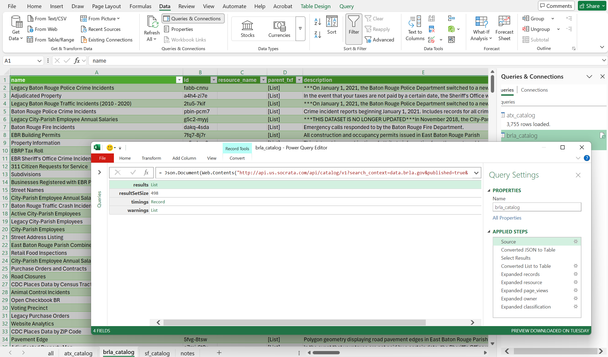

## Why data portal measures matter

Web analytics provides raw data on all assets on a data portal. Analytics combined with metadata and dataset information provide a holistic view of how people are accessing open data that can be presented to data owners and the public.

Dataset characteristics like category, agency function, expected user group, information type, and related open government principle have been used to evaluate the public usefulness of a data catalog [@schwoerer2022]. The evaluation of metadata completion, communication mechanisms, and publishing frequency provides a way to track the commitment of a program to providing open data [@nahon2015].

## Web Analytic Measures

Data portals typically provide the number of views of assets, downloads of datasets, and programmatic requests to the API (application programming interface) endpoints of assets.

Additional measures of quality may be inferred by the contents of data catalogs and capabilities of data portals.

## Data Collection

Data portals displage the lifetime page views for data assets on individual overview pages, data catalog listings, and through APIs (application programming interface). Tyler Technologies and Esri provide documentation on their use [@tylertechnologies2022], [@esri].

### Overview Pages

Dataset overview pages provide important details about the data and lifetime page views and downloads. An example of an overview page is the [Issued Construction Permits](https://data.austintexas.gov/Building-and-Development/Issued-Construction-Permits/3syk-w9eu/about_data) on the Austin data portal.

[{fig-alt="Screenshot showing the about section on the Issue Building Permits dataset overview page"}](https://data.austintexas.gov/Building-and-Development/Issued-Construction-Permits/3syk-w9eu/about_data)

In the "About" section, the lifetime views and downloads are shown, which for this dataset consist of 5.38 million views and 82.3 thousand downloads.

### Data Catalogs

Data catalogs enable user to search for relevant data and also sort results by assets with the most views. The Tyler Technology open data platform also includes the lifetime views of assets.

As organizations often maintain multiple data portals for geospatial and tabular data, it is important to check whether they have multiple sites and if data is federated to a single portal to facilitate public discovery of data.

Example data catalogs include:

- Austin, Texas

  - Data catalog: <https://data.austintexas.gov/browse>

  - Maps and applications catalog: <https://austin.maps.arcgis.com/home/gallery.html>

- Baton Rouge, Louisiana

  - Data catalog: <https://data.brla.gov/browse>

  - Maps and applications catalog: <https://data-ebrgis.opendata.arcgis.com/search>

- San Francisco, California

  - Data catalog: <https://data.sf.gov/browse>

  - Maps and applications catalog: <https://sfgov.maps.arcgis.com/home/gallery.html>

### APIs (Application programming interfaces)

The Tyler Technologies Discovery API [@socrata] provides analytic details for all data assets on a data portal that includes lifetime views and downloads, as well as views in the last week and month, providing insights on current public interest. Authentication is not required to access information about published data assets on domain. Tools like Excel and Power BI can easily connect to the API endpoint to make information available for analysis.

In the [tylertech_discovery.xlsx](https://github.com/aliciatb/open-data-action-toolkit/blob/main/_data/tylertech_discovery.xlsx) spreadsheet and [tylertech_catalog_analytics.pbix](https://github.com/aliciatb/open-data-action-toolkit/blob/main/_dashboards/tylertech_catalog_analytics.pbix) Power BI dashboard available for download, the following data catalogs were queried and combined to demonstrate how to retrieve and easily refresh web analytic and metadata information.

Below are the API endpoints with parameters to retrieve all published data assets by data portal domain.

- Austin, Texas

  - Discovery catalog endpoint: <http://api.us.socrata.com/api/catalog/v1?search_context=data.austintexas.gov&published=true&limit=5000>

- Baton Rouge, Louisiana

  - Discovery catalog endpoint: <http://api.us.socrata.com/api/catalog/v1?search_context=data.brla.gov&published=true&limit=5000>

- San Francisco, California

  - Discovery catalog endpoint: <http://api.us.socrata.com/api/catalog/v1?search_context=data.sf.gov&published=true&limit=5000>

## Reporting

The following screenshot of a Power BI report demonstrates the type of useful information that can be found about the use of data assets from open data portals. The report and an excel file are available on the code repository for demonstration purposes.

{fig-alt="Dashboard screenshot of a Power BI report with analytic data for Austin, Baton Rouge, and San Francisco open data assets"}

Data portal publishers have additional analytic data available to them, including measures with date and time information and often share that information publicly. In San Francisco, the value of datasets is assigned by departments based on their internal value and value to the public and is included in their Dataset Inventory Report [@cityandcountyofsanfrancisco].

Example portal reports:

- Austin, Texas

  - [Open Data Portal Web Analytics Dashboard](https://data.austintexas.gov/stories/s/6tzi-5xt6)

- Baton Rouge, Louisiana

  - [Website Analytics Dataset](https://data.brla.gov/Government/Website-Analytics/n9u7-h9i7/about_data)

- San Francisco, California

  - [Dataset Inventory Explorer](https://data.sf.gov/stories/s/Dataset-Inventory-Explorer/dztp-vt7z/)

## Summary of Measures

+-----------------+---------------------------+
| Measure Type    | Asset Type                |
+=================+===========================+
| Views           | - Datasets                |
|                 |                           |
|                 | - Feature layers          |
|                 |                           |
|                 | - Visualizations/Charts   |
|                 |                           |
|                 | - Maps                    |
|                 |                           |
|                 | - Data Stories            |
+-----------------+---------------------------+
| Downloads       | - Datasets                |
|                 |                           |
|                 | - Feature layers          |
+-----------------+---------------------------+
| API requests    | - Datasets                |
|                 |                           |
|                 | - Feature layers          |
+-----------------+---------------------------+
| Catalog Quality | - Category                |
|                 |                           |
|                 | - Description             |
|                 |                           |
|                 | - Publishing frequency    |
|                 |                           |
|                 | - Contact information     |
|                 |                           |
|                 | - Department              |
+-----------------+---------------------------+
| Portal Quality  | - Communication mechanism |
|                 |                           |
|                 | - Support content         |
+-----------------+---------------------------+

: Catalog and portal measures {.striped .hover}
