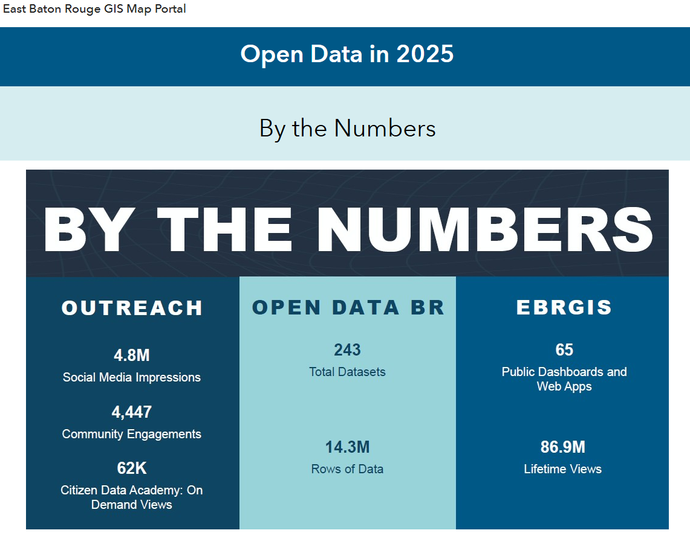

Reporting provides programs the opportunity to link actions to priorities and outcomes.

## Annual Reporting

In Baton Rouge, the open data policy requires annual reporting by the Director of Information Services [@cityofbatonrougeandparishofeastbatonrouge2017b].

> "The report shall include an assessment of progress toward achievement of the goals of the City-Parish’s Open Data BR program (under which all City-Parish open data related activities occur), an assessment of how the City-Parish’s work has furthered or will further the City-Parish’s programmatic priorities, and a description and publication timeline for datasets envisioned to be published by the City-Parish in the following year."

Since 2018, they have published annual reports [@cityofbatonrougeandparishofeastbatonrouge], which are often published directly on their open data platform, such as the most recent 2025 Open Data Policy Report [@cityofbatonrougeandparishofeastbatonrouge2025a]. A consistent feature of their annual reports is the "By the Numbers" section that reports on the number of data products, events, and resulting views and engagement from the community.

[{fig-alt="Image that shows key measures in the 2025 Open Data Policy Report"}](https://ebrgis.hub.arcgis.com/pages/56e664108d96424091d56eaa6a900edc)

## Blogs

Other ways of sharing information about initiatives powered by open data include blog posts. In San Francisco, the new Chief Data Officer explained the strategic vision of the program [@bonaguro2014] initiated by the updated open data policy [@cityandcountyofsanfrancisco2013]. Civic technology and advocacy organizations in Austin have published advocacy agendas [@openaustin2016] and contributions through new data, analysis, and advocacy [@carey2020; @carey2016; @rosenthal2013; @openaustin].

## Dashboards

Asset inventories available on data portals provide views of all assets, like the Austin Open Data Asset Inventory Dashboard [@cityofaustin]. Programs may also add other information to asset inventories like the department assigned value of a dataset, publishing status (some data may only be available internally), update frequency, and monthly views like the San Francisco Dataset Inventory Explorer [@cityandcountyofsanfranciscoa].

Views of applications that span multiple data platforms can be shown on custom dashboards such as the Transparency Performance Metrics dashboard [@cityofbatonrougeandparishofeastbatonrougea] that includes lifetime views of map applications, web tools, department priority dashboards, and citizen data academy video tutorials.

## Catalog of Measures

View all [measures](measures.qmd) used by programs and organizations to track progress and results of their work.
